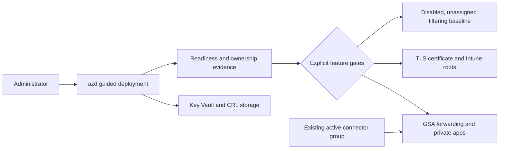

# Global Secure Access proof of concept

Deploy a guarded Azure foundation for evaluating Microsoft Entra Global Secure Access (GSA), then opt in to the tenant features you are ready to test.

This template helps an administrator:

- create a Premium Key Vault and signed certificate-revocation-list (CRL) store;
- evaluate Microsoft 365, Private Access, and Internet Access forwarding;
- configure Quick Access or Private Access against an existing connector group;
- pilot TLS inspection with a non-exportable HSM-backed root certificate;
- prepare Intune trusted-root profiles and an optional disabled Internet filtering baseline;
- generate readiness, drift, ownership, and cleanup evidence before changing tenant state.

> This is a proof of concept, not a production tenant-management or offboarding product. Most GSA `networkAccess` APIs used by the optional automation are Microsoft Graph beta. Tenant mutations are disabled until you explicitly accept the beta boundary and enable individual features.

## Quickstart

### Before you begin

Install [Azure Developer CLI](https://learn.microsoft.com/azure/developer/azure-developer-cli/install-azd), [Azure CLI](https://learn.microsoft.com/cli/azure/install-azure-cli), and PowerShell 7.4 or later. The guided hooks use `Az.Accounts` and `Microsoft.Graph.Authentication` when you enable certificate or Graph operations:

```powershell
Install-Module Az.Accounts -Scope CurrentUser
Install-Module Microsoft.Graph.Authentication -Scope CurrentUser
```

Use an Azure operator who can deploy resources and create role assignments. Optional tenant features require the corresponding Global Secure Access, Application, Intune, or Security administrator role and GSA/Intune licensing. Some environments already have the required Microsoft Graph permissions consented. If Graph consent has not been completed previously, the deployment may require a **Global Administrator or Privileged Role Administrator**. Quick Access and Private Access also require an existing connector group with at least one active connector; this template does not install a connector.

Review the complete [identity, licensing, permissions, and connector prerequisites](docs/technical-reference.md#prerequisites) before enabling tenant automation.

### Deploy the safe foundation

Run the shortest supported path:

```powershell
azd init -t nathanmcnulty/azd-global-secure-access && azd up
```

By default, this provisions the Azure foundation without changing GSA forwarding, applications, Intune profiles, certificates, or Conditional Access. The hooks reuse normal Azure and Microsoft Graph cached or browser authentication; they do not use device-code authentication.

Before provisioning, the template shows the selected environment and safety gates. For an additional Azure-only preview, run `azd provision --preview` from the initialized project.

## What gets deployed



The Azure layer is Bicep. Tenant and data-plane configuration uses idempotent PowerShell hooks and exact object IDs recorded in an ownership manifest. Connector installation, enabling the GSA TLS certificate, broad Intune assignment, and unsupported or insufficiently documented operations remain manual.

## Safety model

- All Graph mutations are off by default and beta surfaces require `GSA_ACCEPT_GRAPH_BETA_TERMS=true`.
- Forwarding profiles change only when their state is explicitly set to `Enabled` or `Disabled`.
- No policy targets all users or all devices by default; the Internet baseline is created disabled and unassigned.
- Matching names never establish ownership. Existing objects are reused but remain unowned unless the committed manifest contains the same object ID.
- A pending transaction is written before configuration and committed only after enabled operations succeed.
- Existing active certificates are preserved during rotation.
- Remote-network plans and logs never store pre-shared keys; execution accepts them only as an in-memory `SecureString`.
- `azd down` removes Azure resources only. Tenant objects are preserved for separate review.

## Choose what to enable

| Capability | Default | Additional gate or prerequisite |
| --- | --- | --- |
| Azure Key Vault and CRL storage | Enabled | Azure deployment and role-assignment authority |
| GSA readiness and drift report | Read-only | Existing Microsoft Graph consent is reused; consent may be required on the first run |
| Forwarding profile changes | Disabled | Beta acceptance and explicit state per profile |
| Quick Access or Private Access | Disabled | Active existing connector group and reviewed segments |
| TLS inspection automation | Disabled | Beta acceptance, Azure PowerShell context, pilot trust plan |
| Intune trusted roots | Disabled | Intune role/consent and reviewed pilot assignment |
| Internet filtering baseline | Disabled and unassigned | Explicit lab acknowledgement and later administrator review |
| Remote-network creation | Plan only | Commercial cloud, exact plan acknowledgement, in-memory shared secret |

Use the [configuration reference](docs/technical-reference.md#configuration) for the complete environment-variable contract and the [safe example](samples/azd-safe-poc.env) as a reference. Never commit a real `.azure/<environment>/.env` file.

## Verify the deployment

After `azd up`:

1. Confirm Key Vault is Premium, RBAC-enabled, purge-protected, and reachable from the signing host.
2. Confirm Storage Shared Key and anonymous blob access are disabled.
3. Run the [read-only readiness report](docs/technical-reference.md#read-only-readiness-report).
4. Verify every enabled forwarding profile, connector group, segment, certificate, and pilot assignment against the reviewed configuration.
5. Test from a pilot device before enabling broader assignment or policy enforcement.

Passing repository tests does not prove tenant licensing, preview API availability, client traffic acquisition, or organization-specific controls. Keep production promotion separate from the proof of concept.

## Documentation

| Guide | Use it for |
| --- | --- |
| [Technical reference](docs/technical-reference.md) | Complete configuration, permissions, ownership, validation, recovery, and API limitations |
| [Architecture](docs/architecture.md) | Trust boundaries and Azure, Graph, certificate, cleanup, and remote-network flows |
| [Release process](docs/release.md) | Maintainer validation, versioning, and publication |
| [Awesome AZD readiness](docs/awesome-azd.md) | Catalog prerequisite checklist and submission fields |
| [Agent-assisted deployment](docs/agent-assisted-deployment.md) | Safe division of work between an administrator and an agent |
| [Client preparation](policies/README.md) | Reviewed endpoint prerequisites and policy examples |

## Cleanup

Generate the non-destructive cleanup plan, review it, and then remove Azure resources:

```powershell
azd hooks run predown
azd down --purge
```

The plan uses only exact IDs from the committed ownership manifest and performs no Graph mutation. Purge protection prevents immediate permanent deletion of the Key Vault. Tenant cleanup is intentionally separate; follow the ownership-aware [cleanup procedure](docs/technical-reference.md#cleanup) and preserve every reused or unmanaged object.

## Security and support

Use a dedicated pilot, least privilege, Privileged Identity Management, staged Conditional Access, and break-glass connectivity that does not depend on the inspected path. Treat local ownership manifests and readiness reports as sensitive administrative evidence even though they must not contain bearer secrets.

This project is released under the [Unlicense](LICENSE). It is provided without warranty and requires administrator review before production use.
