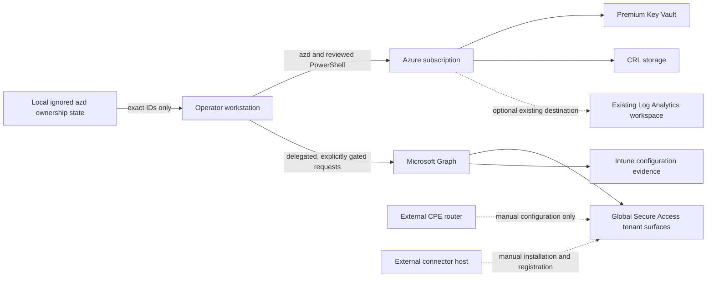
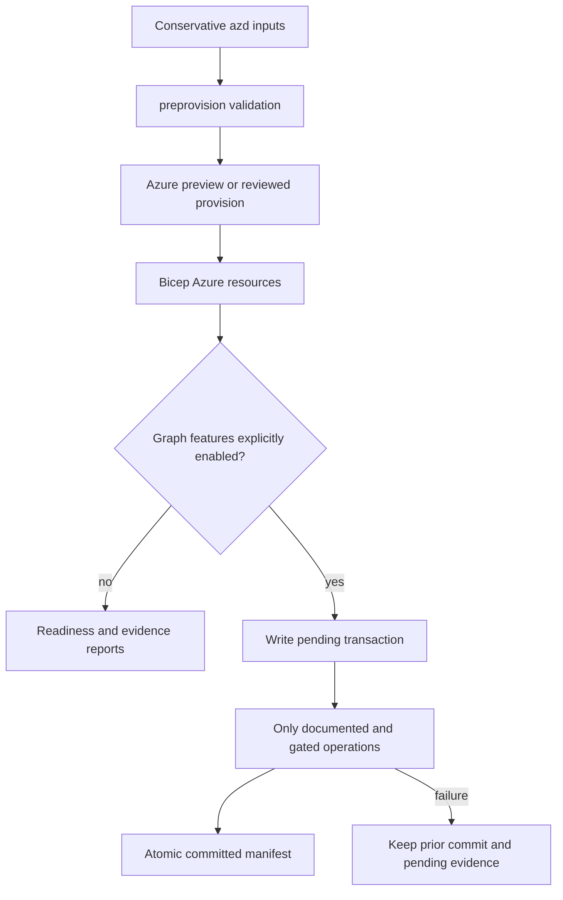
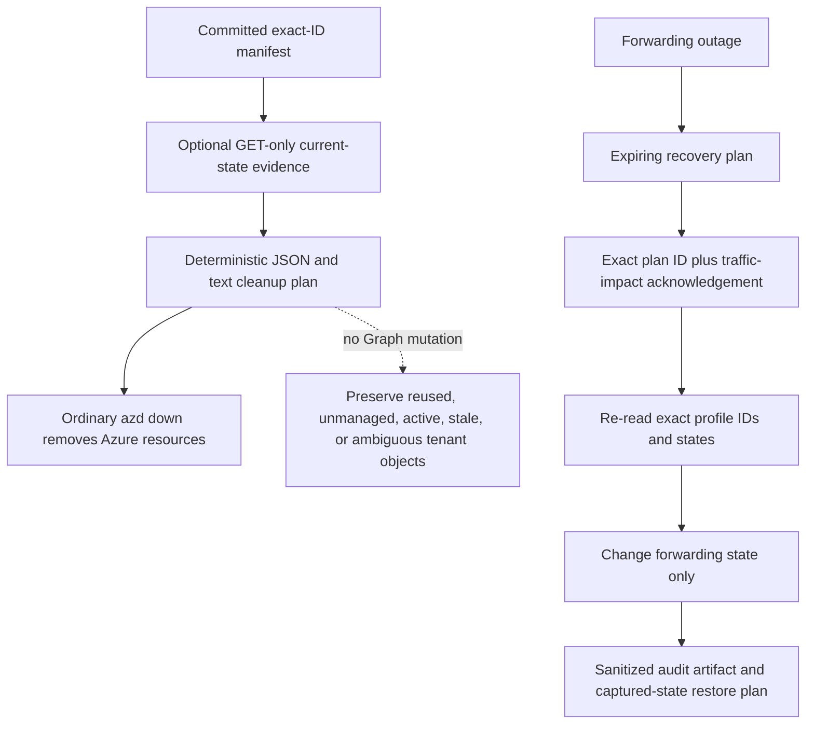
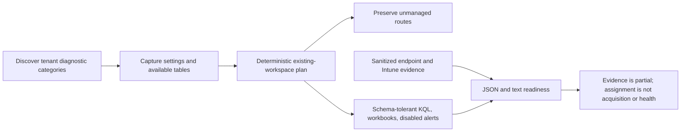
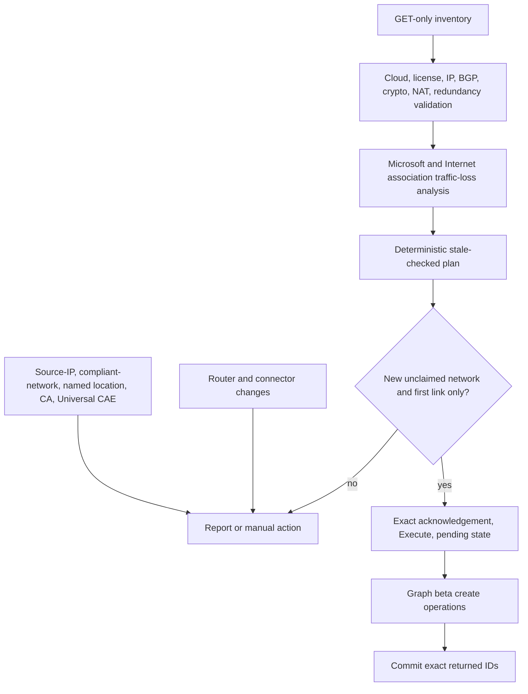

# Architecture and lifecycle diagrams

These Mermaid sources are the reviewable source of truth. An image exported from the architecture diagram can be added later for an Awesome AZD gallery submission, but the repository does not depend on an opaque binary artifact.

## Architecture and trust boundaries

## Deployment lifecycle

## Ownership transaction

```mermaid
stateDiagram-v2
  [*] --> Unclaimed
  Unclaimed --> Pending: write operation ID and desired fingerprint
  Pending --> Committed: all enabled operations succeed and exact IDs return
  Pending --> ReconciliationRequired: interruption or partial failure
  Committed --> Pending: later reviewed change
  Committed --> Reused: never; names cannot transfer ownership
  ReconciliationRequired --> Pending: operator reconciles current state
```

The committed manifest is the sole ownership authority. Display names, natural identifiers, and matching configuration never adopt an object.

## Cleanup and recovery

## Observability and client evidence

## Remote networks and Adaptive Access

## Validation and release lifecycle

```mermaid
flowchart LR
  Change[Reviewed source change] --> Parser[PowerShell parser]
  Parser --> Analyzer[PSScriptAnalyzer 1.25.0]
  Analyzer --> Tests[Pester 5.7.1]
  Tests --> Bicep[Bicep build]
  Bicep --> Azd[Isolated azd 1.30.0 load]
  Azd --> Audit[Diff and packaged-content audit]
  Audit --> PR[Stacked pull request]
  PR --> CI[Non-deploying GitHub Actions]
  CI --> Release[Manual version and changelog decision]
```

